 

**Engenheiro de produto full stack com mais de 5 anos transformando problemas de negócio em software confiável.**

SaaS B2B · automações com IA · plataformas de alto tráfego · performance web

## O que eu levo para o produto

- **Engenharia full stack:** React, Next.js, TypeScript, NestJS, GraphQL, Prisma e PostgreSQL, do modelo de dados à experiência final.
- **Produção de verdade:** Docker, NGINX, Linux, cache, segurança, integrações e diagnóstico de performance.
- **Web de alto tráfego:** WordPress/PHP sob medida, Core Web Vitals, SEO técnico e operação de portais editoriais.
- **Visão de produto:** arquitetura, decisões técnicas, code review, mentoria e entregas guiadas por impacto — não apenas por quantidade de features.

## Trabalho selecionado

<table>
<tr>
<td width="44%" valign="top">
  
</td>
<td width="56%" valign="top">

### Ecossistema RUK

Produtos SaaS B2B para assinatura eletrônica e automação jurídica. Atuação em arquitetura, modelagem de dados, APIs, autenticação e entrega de interfaces administrativas.

`React` `Next.js` `NestJS` `GraphQL` `Prisma` `Docker`

[Ver cases no portfólio](https://leotino.dev/#projects) · [Conhecer a RUK](https://ruk.com.br)

</td>
</tr>
<tr>
<td width="44%" valign="top">
  
</td>
<td width="56%" valign="top">

### Plataformas editoriais de alto tráfego

Engenharia e evolução de portais com foco em disponibilidade, cache, SEO técnico, Core Web Vitals e fluxos de publicação de grande volume.

`WordPress` `PHP` `MySQL` `NGINX` `Cloudflare` `SEO`

[Ver cases no portfólio](https://leotino.dev/#projects) · [Visitar ABC Mais](https://abcmais.com)

</td>
</tr>
</table>

> O código de produtos comerciais permanece privado por confidencialidade. Os cases públicos apresentam contexto, responsabilidades e decisões sem expor propriedade de clientes ou empregadores.

## Código público

### [Portfólio interativo](https://github.com/ltin0/leo-portfolio)

Portfólio bilíngue em Next.js com identidade retro-futurista, catálogo de projetos, currículo, formulário server-side e interações autorais.

`Next.js 16` `React 19` `TypeScript` `Tailwind CSS` `Nodemailer`

[Explorar o código](https://github.com/ltin0/leo-portfolio) · [Abrir a experiência](https://leotino.dev)

## Stack principal

  

## Atividade com uma assinatura autoral

Este grid é gerado diariamente por um script Python deste próprio repositório. A nave percorre as contribuições reais do último ano; se a automação parar, o último SVG continua funcionando.

<strong>English summary</strong>

Full-Stack Product Engineer with 5+ years of experience building B2B SaaS products, high-traffic publishing platforms, e-commerce and AI-enabled workflows. I work across product architecture, TypeScript/React applications, Node.js/NestJS APIs, WordPress/PHP systems, databases and production infrastructure.

Most commercial source code remains private due to confidentiality. The portfolio presents responsibilities, technical decisions and outcomes without exposing proprietary assets.

[Portfolio](https://leotino.dev) · [LinkedIn](https://linkedin.com/in/leonardo-tino) · [Email](mailto:leo_tino@outlook.com.br?subject=Opportunity%20—%20Full-Stack%20Product%20Engineer)

### Tem um produto complexo, uma vaga ou um problema técnico interessante?

[Vamos conversar no LinkedIn](https://linkedin.com/in/leonardo-tino) · [Me envie um e-mail](mailto:leo_tino@outlook.com.br?subject=Oportunidade%20—%20Full-Stack%20Product%20Engineer)

