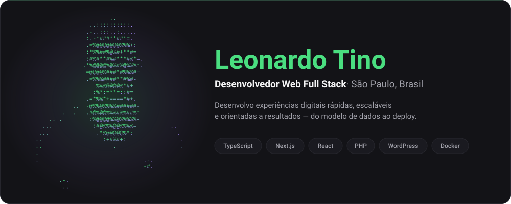

<!--
═══════════════════════════════════════════════════════════════════════════════
  README de perfil — Leonardo Tino · github.com/ltin0
  Repositório: ltin0/ltin0 (precisa ter EXATAMENTE o mesmo nome do usuário)

  PARTIDO: perfil visual, não currículo. A leitura é uma sequência de imagens
  centralizadas, com o mínimo de texto corrido. Quem quer detalhe vai no
  portfólio ou no currículo — os dois estão linkados no topo e no rodapé.

  IDENTIDADE VISUAL
    fundo    #0A0A0C      superfície  #131317      borda      #26262D
    verde    #4ADE80      violeta     #A78BFA
    texto    #F4F4F5      secundário  #A1A1AA
  Para trocar o acento, faça Localizar/Substituir de 4ADE80 no arquivo todo.

  ARQUIVOS DESENHADOS À MÃO (não são serviço externo, então não caem)
    assets/hero.svg  — regerar com:  python scripts/build_hero.py
    assets/wave.svg  — editar as cores direto no arquivo

  RESTRIÇÕES DO GITHUB RESPEITADAS AQUI
  • Zero JavaScript (o GitHub não executa)
  • Zero style="" e class="" no markdown (o sanitizador remove)
  • Layout via 
, <table>, width= — a única forma confiável
  • Toda  tem alt=
═══════════════════════════════════════════════════════════════════════════════
-->

<!-- Card de hero: retrato ASCII (gerado do avatar real) + identidade.
     O conteúdo dele vive em scripts/build_hero.py, não aqui. -->

 

<!-- EDITAR: as frases da animação ficam em &lines=, separadas por ";".
     Espaço = "+"   ·   "&" = %26   ·   "," = %2C   ·   máx. ~6 frases -->

 

<!-- ── Contato. Quatro destinos, dois com peso maior. ──
     EDITAR: confirme LinkedIn, e-mail, portfólio e a URL do PDF do currículo. -->

&nbsp;

<!-- ── O único bloco de texto do arquivo. Cinco linhas, não cinco parágrafos.
     EDITAR: se precisar cortar, corte de baixo para cima. -->

- **Full Stack há mais de 5 anos** — hoje em produtos SaaS B2B com React, Next.js, TypeScript, NestJS, GraphQL e Prisma
- **WordPress e PHP de verdade** — plugins modulares e temas sob medida, não colagem de page builder
- **Alto tráfego** — portais editoriais e e-commerce: cache, NGINX, Cloudflare, Core Web Vitals e SEO técnico
- **Bacharel em Ciência da Computação**, cursando pós-graduação em IA com foco em LLMs
- **São Paulo, Brasil** — remoto, BRT (UTC−3), português nativo e inglês fluente

<!-- ── Stack. Grid de ícones em vez de fileiras de badge: mesma informação,
     um terço da altura e muito mais parecido com uma vitrine.
     EDITAR: a lista fica em ?i=... e a quebra de linha em &perline=.
     Catálogo de slugs: https://skillicons.dev -->

  

<!-- ── Atividade. Sem título de seção: o gráfico se explica sozinho. ── -->

  

<!-- ── Pac-Man, gerado por .github/workflows/pacman.yml.
     As imagens só aparecem depois da primeira execução do workflow.
     EDITAR — trocar de jogo: mude o input "games" no workflow. A action também
     gera breakout, galaga, puzzle-bobble, bomberman e minesweeper. O arquivo
     acompanha o nome do jogo: <jogo>-contribution-graph.svg -->
<picture>
  <source media="(prefers-color-scheme: dark)"  srcset="https://raw.githubusercontent.com/ltin0/ltin0/output/pacman-contribution-graph-dark.svg" />
  <source media="(prefers-color-scheme: light)" srcset="https://raw.githubusercontent.com/ltin0/ltin0/output/pacman-contribution-graph.svg" />
  
</picture>

  

<!-- ── Contribuições em 3D, geradas por .github/workflows/profile-3d.yml.
     EDITAR: a action gera 10 temas na pasta profile-3d-contrib/. Além do usado
     abaixo existem profile-green-animate, profile-season-animate,
     profile-night-view, profile-night-rainbow, profile-gitblock, profile-green,
     profile-season, profile-south-season e profile-south-season-animate.
     Os terminados em "-animate" têm movimento. -->

<!-- ═══════════════════════════════════════════════════════════════════════════
     Versão em inglês, colapsada — custa uma linha de altura e abre o perfil
     para recrutador de fora. EDITAR: apague o bloco se quiser só português.
     ═══════════════════════════════════════════════════════════════════════════ -->

<b>Read this profile in English</b>

 

- **Full Stack developer, 5+ years** — currently on B2B SaaS products with React, Next.js, TypeScript, NestJS, GraphQL and Prisma
- **Real WordPress and PHP work** — modular plugins and bespoke themes, not page-builder glue
- **High traffic** — editorial portals and e-commerce: caching, NGINX, Cloudflare, Core Web Vitals and technical SEO
- **BSc in Computer Science**, currently taking a postgraduate degree in AI focused on LLMs
- **São Paulo, Brazil** — remote, BRT (UTC−3), native Portuguese and fluent English

Open to **Full Stack**, **Front-end**, **React/Next.js** or **WordPress/PHP** roles.
**[› Reach out on LinkedIn](https://linkedin.com/in/leonardo-tino)** &nbsp;·&nbsp; **[› Send me an email](mailto:leo_tino@outlook.com.br?subject=Opportunity%20—%20Full%20Stack%20Developer)**

<!-- ═══════════════════════════════════════════════════════════════════════════
     ESTRUTURA DE PROJETOS — PRONTA, SÓ DESCOMENTAR

     Enquanto não houver projeto público para mostrar, o badge "Projetos" no
     topo manda o recrutador para o portfólio, que já tem conteúdo. Card vazio
     é pior que card nenhum.

     IMAGENS: coloque em /assets e use caminho relativo (ex.: assets/projeto-1.png).
              Recomendo 720×405 px (16:9), < 2 MB. Sem print, apague a .
     REGRA: 3 projetos sólidos convertem melhor que 5 com dois fracos —
            o recrutador julga pelo pior, não pela média.

<table>
<tr>
<td width="45%" valign="top">

</td>
<td width="55%" valign="top">

**{{NOME_DO_PROJETO_1}}**

{{DESCRICAO_EM_UMA_FRASE}}

**Problema resolvido** — {{QUAL_DOR_ISSO_RESOLVE_PARA_O_USUARIO_OU_NEGOCIO}}

**Stack** — `{{TECNOLOGIA}}` `{{TECNOLOGIA}}` `{{TECNOLOGIA}}`

[Código]({{URL_REPO_1}}) &nbsp;·&nbsp; [Ver funcionando]({{URL_DEMO_1}})

</td>
</tr>
</table>

| Projeto | O que resolve | Stack | Links |
| :--- | :--- | :--- | :--- |
| **{{NOME_DO_PROJETO_2}}** | {{PROBLEMA_EM_UMA_LINHA}} | `{{TEC}}` `{{TEC}}` | [Código]({{URL_REPO_2}}) · [Demo]({{URL_DEMO_2}}) |
| **{{NOME_DO_PROJETO_3}}** | {{PROBLEMA_EM_UMA_LINHA}} | `{{TEC}}` `{{TEC}}` | [Código]({{URL_REPO_3}}) · [Demo]({{URL_DEMO_3}}) |

     ═══════════════════════════════════════════════════════════════════════════ -->

<!-- ═══════════════════════════════════════════════════════════════════════════
     CARDS DE STATS E LINGUAGENS — DESATIVADOS DE PROPÓSITO

     Testei em 11/08/2026: a instância pública do github-readme-stats
     (github-readme-stats.vercel.app) responde 503 DEPLOYMENT_PAUSED e a de
     troféus (github-profile-trophy.vercel.app) responde 402. Deixar ativo hoje
     significa imagem quebrada no perfil — pior que não ter nada.

     COMO ATIVAR DIREITO (~5 min, e resolve de vez porque passa a ser SEU deploy):
       1. Fork de https://github.com/anuraghazra/github-readme-stats
       2. Importe o fork em https://vercel.com/new (framework: Other)
       3. Crie um Personal Access Token do GitHub (escopo: public_repo)
       4. Na Vercel, adicione a variável de ambiente PAT_1 com esse token
       5. Troque SEU-DEPLOY.vercel.app abaixo pelo domínio do seu deploy
       6. Descomente o bloco

  
  

     ═══════════════════════════════════════════════════════════════════════════ -->

 

**Vamos construir algo juntos?**

Se você tem uma vaga, uma ideia de produto ou um problema técnico que vale a pena resolver — me chama.

 

